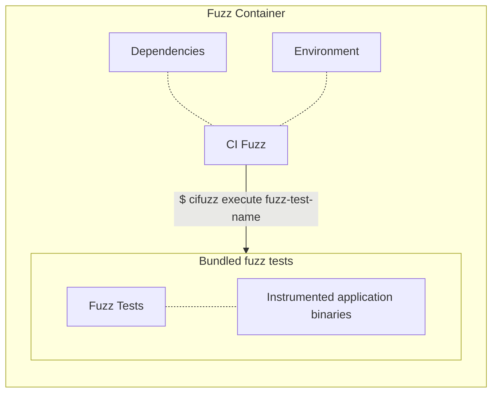
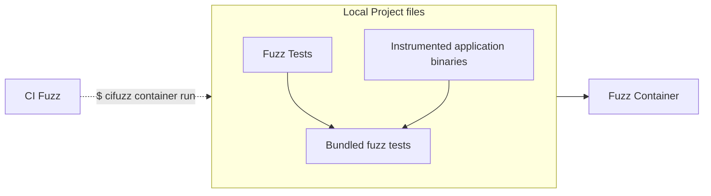

# cifuzz container

`cifuzz container` commands are a set of new features that will mature and become a standard way of running fuzz tests in CI Sense.

> This page is documenting a limited preview of the Fuzz Containers. Functionality is experimental and we are open to feedback.

We aim to improve the experience of running fuzz tests in [CI Sense](https://www.code-intelligence.com). Container-based workflow proposed by the `cifuzz container` commands should replace our current bundle mechanism and become a primary way of running fuzz tests in CI Sense.

## Motivations

We want to solve multiple user problems with the current `cifuzz bundle` and `cifuzz remote-run` commands. To name a few:

- **Reproducibility and debugging**: container images are providing a good base for replaying and debugging issues. Either locally or in CI Sense. Current bundles are not immutable and are not providing local reproducibility.
- **Removing runtime limitations**: allowing users to rely on repeatable container runtimes, with dependencies and settings fixed in time as part of the container image, we aim to allow better precision and reusability of fuzzing workloads.
- **Removing scaling limitations**: there are multiple soft&hard limitations, like bundle file sizes, or difficulty of scaling workloads to _really big_ numbers, that we'd like to tackle and resolve by using containers.
- **Future expansions**: With containers, we can adapt to different workflows, requirements and fuzzing targets. We are also open to a wider array of technologies and approaches we can support.

There are other goals this project will allow us to handle in the future, like improving cross-platform builds and tests or even more varied projects and setups.

## Before you start

There are a few prerequisites to using `cifuzz container` commands:

- These features are currently supported on Linux and macOS.
- You need to have Docker Engine installed, or a (remote) Docker socket available on your machine.

## What is a Fuzz Container?

**Fuzz Container contains fuzz tests and all environments and files needed to run them.** It's a self-contained and repeatable unit.



Because Fuzz Container is a Container Image, it can be freely shared, stored and inspected.

## Building and running a Fuzz Container locally

`cifuzz container` commands provide a way to build a Fuzz Container image from a project directory. The `run` command is a way to run a Fuzz Container locally:

```terminal
cifuzz container run -C examples/gradle com.example.FuzzTestCase::myFuzzTest
```

This command will:

1. Build and **bundle your Fuzz Tests** using the functionality of the `cifuzz bundle` command.
1. **Uses the bundle to build a Fuzz Container image** including a copy of `cifuzz` and contents of the bundle. Base Docker image can be set by the user with a command-line flag.
1. Runs the **Fuzz Test in a container** using the `cifuzz execute`. Run of the Fuzz Test and its reporting works similarly to the `cifuzz run` command.



You can define the Docker image used for creating the Fuzz Container with a `--docker-image` flag. This is important for images requiring specific environments or dependencies like LLVM and Clang.

```terminal
cifuzz container run --docker-image my-docker-image-with-llvm:latest -C examples/cmake my_fuzz_test
```

See `cifuzz container run --help` for a full list of options.

Currently, the building and bundling of a Fuzz Tests happens on a local machine. But even this step could be scripted and moved into a container in the future, allowing repeatable and reproducible builds everywhere.

See `cifuzz container run --help` for more information on building your Fuzz Containers.

## Running a Fuzz Container in CI Sense

The `cifuzz container remote-run` command currently doesn't trigger a remote run on CI Sense. Instead it pushes a Fuzz Container to a specified container registry.

See the `cifuzz container remote-run --help` for more information.
